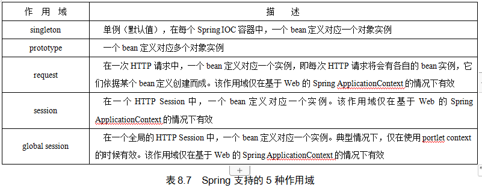
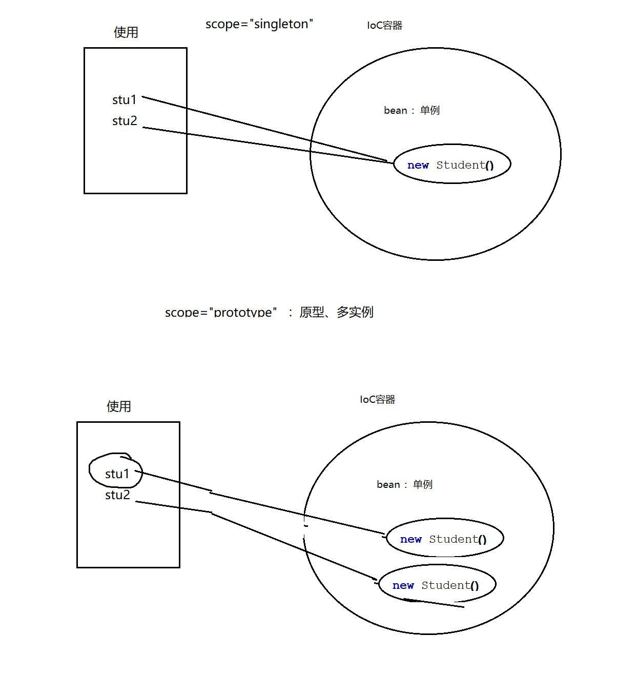
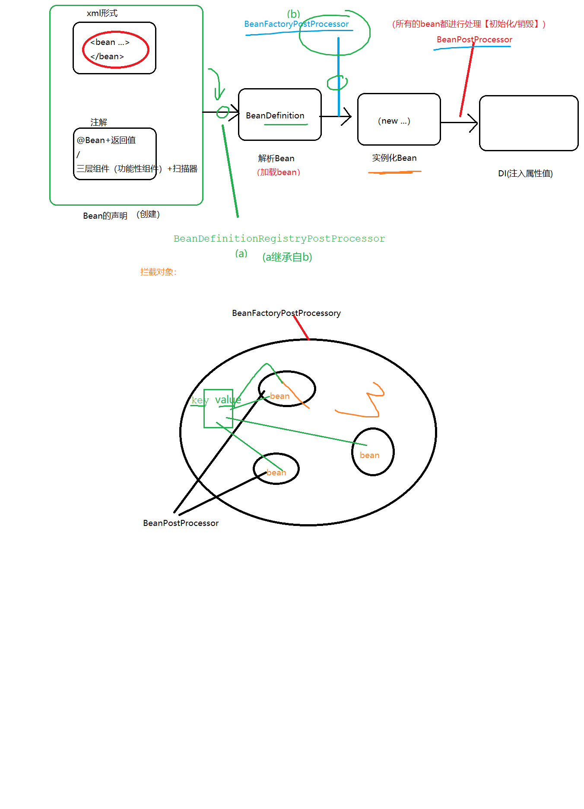

# Spring IoC容器？  
## 两种形式：  
1. xml配置文件：applicationContext.xml
   存bean:  <bean id class>  
   取bean: ApplicationContext context= new ClassPathXmlApplicationContext("applicationContext.xml");     
   context.getBean();
> 注意：两种形式获取的Ioc容器是互相独立的！
2. 注解：带有@Configuration注解的类（配置类）    
   存bean  
   XXX  
   取bean  
   ApplicationContext context  = new AnnotationConfigApplicationContext(MyConfig.class);  

   ### XXX:注解形式 给IoC容器中存放Bean：  
   1. 必须有@Configuration注解（配置类）  

   2. 形式:   
      1. ①**三层组件形式**加入IOC容器： (两步: 给各类加注解 、 扫描器识别注解所在包)   
         1. 给三层组件 分别加注解（@Controller、@Service、@Repository -> @Component(通用，分层不确切的情况)）  
         2. 将注解所在包 纳入ioc扫描器（ComponentScan）  
             1. xml配置文件扫描器: <context:component-scan base-package="com.legend.controller"></context:component-scan>   
                逻辑： 在三层类上加注解，让ioc识别，扫描器   
                - **component-scan: 只对三层组件负责**  
             2. 注解扫描器(@ComponentScan, 指定Spring扫描哪些包(也是只对三层组件负责！))  
                - 给扫描器指定规则   
                  - 过滤类型：FilterType(ANNOTATION，ASSIGNABLE_TYPE，CUSTOM)  
                     >ANNOTATION（某一批标注了三层注解的类）：三层注解类型@Controller、@Service、@Repository -> @Component(无法判断规则时，等价通用)  
                    
                         excludeFilters：排除   
                         includeFilters：有默认行为，可以通过useDefaultFilters = false禁止  
                         1. value="com.legend"已经是包含com.legend包下所有的，默认useDefaultFilters为true, includeFilters再包含不会起作用；useDefaultFilters为false让includeFilters起作用！  
                     >ASSIGNABLE_TYPE（某一个标注了三层注解的类）：具体的类(StudentService.class)  

                      _区分:_   
                              ANNOTATION:Controller.clss 指的是 所有标有@Controller的类   
                              ASSIGNABLE_TYPE：值得是具体的一个类 StudentController.class  

                      >CUSTOM自定义：自己定义包含规则  

                      @ComponentScan.Filter(type= FilterType.CUSTOM ,value={MyFilter.class}  
                      MyFilter implements TypeFilter 重写其中的match，如果return true则加入IoC容器  
                     
      2. **②非三层组件形式**(Student.class 、IntToStringConver.class):  
         - @Bean+方法的返回值 ,id默认就是方法名（可以通过@Bean("stu") 修改id值）  
         - import 、FactoryBean  

     **bean: 类**  
     a.  非三层组件   ：Student\Teacher\配置信息  : @Bean  
     b.  三层组件 ：Controller、Service、Dao  ：@Component(@Controller、@Service、@Repository)

三层组件(总结):  
a.加入@Component等注解  
b.配置，让容器识别注解  

i.XML形式：通过扫描器  将@Component等注解所在包 扫描  

    `<context:component-scan base-package="com.legend" >  

    			</context:component-scan>  

ii.注解：@Configuration  

@ComponentScan(value="com.legend")  

public class MyConfig {...}`  

component-scan指定规则：

FilterType ：

ANNOTATION：指定类型 (@Compent @Controller  @Service  @Repository)

ASSIGNABLE_TYPE :自定义类的类中选 StudentDao

ASPECTJ,) 

REGEX,) 

CUSTOM：自己定义包含规则) 

a.@ComponentScan.Filter(type= FilterType.CUSTOM,classes ={ MyFilter.class  })}, useDefaultFilters = false)  ) 

b.MyFilter  implements TypeFilter   重写match()方法，如果return true则加入IoC容器  ) 

---) 

@Component(@Controller、@Service、@Repository)：三层组件) 

非三层组件) 

### P2 bean的作用域:   
  
  
	scope:  singleton（默认）| prototype  
执行时机（产生bean的时机）：  
singleton: 容器在初始化时，就会创建对象（唯一的一个）；以后再getBean时，不再产生新的bean。singleton也支持延迟加载(懒加载): 在第一次使用时产生。 @Lazy  
prototype: 容器在初始化时，不创建对象；只是在每次使用时（每次从容器获取对象时，context.getBean(Xxxx)）,再创建对象;并且  每次getBean()都会创建一个新的对象。  

### 条件注解 Spring Boot
可以让某一个Bean 在某些条件下 加入Ioc容器，其他情况下不加IoC容器。  
a.准备 bean  Car EnergyCar、OilCar  
b.增加条件Bean：给每个Bean设置条件 ，必须实现Condition接口  EnergyCarCondition、OilCarCondition  
c.根据条件，加入IoC容器  @Bean、@Conditional  

### 回顾给IoC加入Bean的方法  
**注解 ：全部在@Congiration配置中设置：**  
三层组件： 扫描器 + 三层注解  
非三层组件：    
            ①@Bean+返回值  
            ②@import  （Apple、Oracle Banana）  
            ③FactoryBean(工厂Bean)   

### P3  
2. @import使用(三种使用方式)：  
①直接编写到@Import中，并且id值 是全类名（com.legend.entity.Apple）   
②自定义ImportSelector接口的实现类，通过selectimports方法实现（方法的返回值 就是要纳入IoC容器的Bean）。并且 告知程序 自己编写的实现类。 @Import({Orange.class, MyImportSelector.class})   
③编写ImportBeanDefinitionRegistrar接口的实现类，重写方法  ctrl+alt+b 查看接口的实现类   
@Import({Orange.class, MyImportSelector.class, ImportBeanDefinitionRegistrar.class})   

3. FactoryBean(工厂Bean，与@Bean平级的)  
1.准备(工厂)bean。实现类和重写方法   
2.注册bean(myFactory类)。注册到@Bean中  
(创建Bean对象时)注意：需要通过&区分 获取的对象是哪一个 ： 
- 不加&,获取的是最内部真实的Apple(实现FactoryBean的真实对象)    
- 如果加了&，获取的 是FacotryBean本身(@Bean + 返回值)   

>P4前提(区分):  IoC容器：初始化容器、..使用容器、销毁容器  
### P4 Bean的生命周期：创建(new ...)、初始化（赋初值）、  ....、销毁	(servlet)  
>意义：我们可以在bean的xxx生命周期阶段可以干些什么！  
   > 比如，获取后修改bean的属性值，对bean做进行操作  
#### 方法一: Student.java   
适用于：@Bean+返回值方式  
init(自定义容器初始化阶段需要做什么， myInit())   destroy(自定义容器销毁阶段需要做什么，myDestroy())  
##### xml:  
init-method="myInit"  destroy-method="myDestroy"  
##### 注解：  
@Bean(value="stu",initMethod = "myInit",destroyMethod = "myDestroy")  
IoC容器在初始化时，会自动创建对象(构造方法) ->init ->.....->当容器关闭时 调用destroy...  

#### 方法二：  
三层注解 （功能性注解、MyIntToStringConverter.java）：@Controller、@Service、@Repository、@Component  

-->三层注解（(广义)功能性注解【三层、功能性类】）  
三层组件： 扫描器 + 三层注解（4个）  

	JAVA规范 ：JSR250  适用于三层组件(功能性！)  
	1.将响应组件 加入 @Component注解、 给初始化方法加@PostConstruct、给销毁方法加@PreDestroy  
	@PostConstruct：相当于方法一的init，标注方法名称自定义  
	@PreDestroy：相当于方法一的destroy，标注方法名称自定义  

	如果要获取@Component注解中的bean，那么该Bean的名字就是@Component（value="xxx"）的value值  或类的首字母小写名称   

#### 方法三：两个接口（案例: MyFunction类）  
接口：也适用于三层组件（扫描器+三层组件）  
InitializingBean接口初始化  
DisposableBean接口销毁  

	初始化：只需要 实现InitializingBean中的afterPropertiesSet()方法  
	销毁：实现DisposableBean 中的destroy()方法  

>问题：  
> 方法二、三都要在Spring IOC容器中操作：  
> 操作方式 对象：Bean+返回，三层组件   
1. 如果是注解形式(方法二)， 随便写一个方法(m名) ，然后加上相应注解即可  
2. 如果是接口形式(方法三)，必须实现接口中**规定的方法**  

#### 方法四：（给容器中的**所有Bean加**初始化、销毁, "研究别人!"）一个接口   (案例: MyXxx类)  
发生时机: 容器创建出bean, 容器初始化bean前  
接口：适用于三层组件  
接口BeanPostProcessor：拦截了所有中容器的Bean  

### P5自动装配  : 三层组件(4个注册+扫描器)  
@Autowired    
Controller->Service->Dao  
1. 三层组件  
通过@Autowired从Ioc容器中 根据类型自动注入（没有调用setXxx()方法）  
- 如果@Autowired在属性前标注，则不调用setXxx(调用bean的set方法！)；如果标注在setXxx前面 ，则调用setXxx方法  
- 不能放在方法的参数前！  
`@Autowired  
private Xxx xx;  
public void aa()  
{  
}  
@Autowired  
public void setXxx(xx xx)   
{    
}  
`
2. Bean+返回值：  
- @Autowired(可以放)在方法的参数前（也可以省略）  
- @Autowired放在方法前 （构造方法：特殊，如果只有一个有参构造方法，则构造方法前的@Autowired也可以省略）  
`  
public void setXxx(@Autowired xx xx)  
{  
}  
`

之前：@Autowired 根据类型匹配：(案例: StudentService类)   
三层注入方式/@Bean+返回值  
1.如果有多个类型相同的，匹配哪个？   
报错。 解决办法：利用@primary设置为默认bean  
2.能否根据名字匹配？    
结合 @Qualifier("stuDao2")使用 ——三层注入方式时。    
补充：方法参数前添加@Autowired @Qualifier("address2");注：@Autowired可省略 ——@Bean + 返回  
3.如果有0个类型相同（没有扫到注入的bean），默认报错；可以修改成不注入（null），@Autowired(required=false)  

自动注入方式一：	@Autowired (Spring) ，**默认根据类型**  
自动注入方式二	@Resource（JSR250），**默认根据名字**(如果有名字，根据名字匹配；如果没有名字，先根据名字查找，如果没找到，再根据类型查找);也可以通过name或type属性 指定根据名字 或类型找。  
自动注入方式三：	@Inject（JSR330），额外引入javax.inject.jar，**默认根据类型匹配**:   
`<dependency>  
    <groupId>javax.inject</groupId>  
    <artifactId>javax.inject</artifactId>  
    <version>1</version>  
</dependency>`  

### P6 利用Spring底层组件进行开发 (三层组件)  
>能够供我们使用的(xxx容器的)组件，都是Aware的子接口，即XxxxAware(包含了Xxx容器的组件！)  

以ApplicationContextAware为例: 实现步骤  
a.实现ApplicationContextAware，  
b.重写其中的方法，都包含了一个对象(xxx容器的组件)。只需要将该对象 赋值到属性中即可  

	有什么用：例如ApplicationContextAware，可以通过该接口获取到Ioc容器对象。  
	执行时间：	如果在main()中new Ioc容器： 先执行ApplicationContextAware实现类中的方法，通过该方法传入IoC容器供我们自己使用；  然后再将该容器通过（main()中）的new返回给用户  

	BeanNameAware：  

-- 环境切换：@Profile  
Spring:切换(任何)环境  

激活方式一：(idea Vm Options填写)  
-Dspring.profiles.active=@Profile环境名  
-Dspring.profiles.active=myApple  

	(适用场合)数据库环境切换：  
		@Profile  
		127.0.0.1  scott  tiger    

		@Profile  
		192.168...  
激活方式二：  
硬编码  

	坑：错误写法  
			        ApplicationContext context = new AnnotationConfigApplicationContext(MyConfig.class);  

        ConfigurableEnvironment environment = (ConfigurableEnvironment)context.getEnvironment();  
        environment.setActiveProfiles("myBanana");  
    
    注：|代表保存点
	其中AnnotationConfigApplicationContext中有一个refresh()操作：会将我们设置的一些参数还原  
	没激活 | ->进行激活 ->刷新 ->没激活  

	流程调整：  
		没激活->进行激活  |    ->刷新  

什么时候设置 保存点|： 配置类的编写处  
IoC容器在使用时必须refresh() ;如果是有参构造，内部已经刷新；如果无参构造，需要手工刷新。  

> 激活方式三(空白)：xml文件形式的@Profile切换环境(idea提示)  

### P7 Spring重要组件  
接口BeanPostProcessor：拦截了所有中容器的Bean，并且可以进行bean的初始化 、销毁  
创建->初始化->...->销毁    
- BeanPostProcessor：拦截所有bean 
- BeanFactoryPostProcessor：拦截了容器  
- BeanDefinitionRegistryPostProcessor：(BeanDefination)即将被加载之前（解析之前，称为BeanDefination对象之前）拦截BeanDefination  

BeanDefinitionRegistryPostProcessor(a)  ->加载bean->BeanFactoryPostProcessor(b)->实例化bean->BeanPostProcessor  
同一个方法 在不同地方（类、接口）的出现时机问题：a继承b，因此a中必然包含b中的方法(记c )：虽然a和b中都有c，但是 因此c出现的时机不同， 则c的执行顺序也不同： 如果是在a中出现，则先执行；如果是在b中执行 则后执行  

在同一个地方（类、接口），的不同方法的出现时机问题  

### P8 监听器：  
可以监听事件 ，监听的对象必须是 ApplicationEvent自身或其子类/子接口(内置只有6个)  
方式一：  
1必须实现ApplicationListener接口   

方式二：注解  
(语法上 可以监听任意事件{ApplicationEvent.class, xxxx.class,ApplicationEvent的自身或其子类/子接口.class}，但建议 ApplicationEvent自身或其子类/子接口)  
Spring：要让Spring识别自己，必须加入IOc容器（Bean+返回值| 注解+扫描器）  

自定被监听事件  
前提：监听的对象必须是 ApplicationEvent自身或其子类/子接口，内置只有6个;所以根据自己需要自定义监控事件  
a.自定义类 实现ApplicationEvent接口（自定义事件）  
b.发布事件  
context.publishEvent(自定义事件);  

颜群老师微信: 157468995  
